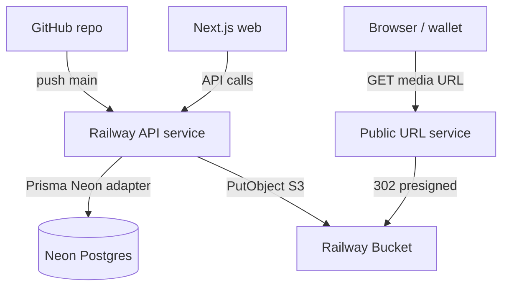

# Railway API Deployment

Deploy the Tokenizer API (`apps/api`) to Railway with GitHub integration, your existing Neon Postgres database, and Railway Buckets for media storage.

## Architecture



| Component | Provider | Notes |
|---|---|---|
| API runtime | Railway (Docker) | Long-lived Bun/Elysia server |
| Database | Neon (existing) | Pooled `DATABASE_URL`, `DB_DRIVER=neon` |
| Media storage | Railway Bucket | `STORAGE_DRIVER=s3` |
| Public media URLs | Railway Public URL template | Stable CDN-style links |
| Deploy trigger | GitHub integration | Auto-deploy on push |

The repo includes `railway.toml` at the monorepo root so Railway builds from `apps/api/Dockerfile` with the full workspace context (the API imports `packages/config`).

On container start, the entrypoint runs `prisma migrate deploy` before starting the compiled server binary.

## Prerequisites

- A Railway account
- This repository pushed to GitHub
- An existing Neon Postgres project (pooled connection string)
- Deployed factory contract and RPC endpoint for your target chain
- (Recommended) Custom domains for API and media CDN

## Step 1: Create Railway project and API service

1. In the [Railway dashboard](https://railway.com), create a new project (for example `moonwell` or `kozeki`).
2. Add a service named `api`.
3. Connect your GitHub repository:
   - **Branch:** `main` (or your production branch)
   - **Root directory:** repo root (default — required for monorepo Dockerfile context)
   - Railway picks up `railway.toml` automatically for Docker builds and health checks.

Alternatively, initialize via CLI (GitHub OAuth connect still happens in the dashboard):

```bash
railway init --name <project-name>
railway add --service api
# Connect GitHub repo in dashboard (CLI cannot fully replace GitHub OAuth connect)
```

## Step 2: Wire Neon database

From your Neon dashboard, copy the **pooled** connection string (host contains `-pooler`).

On the `api` service **Variables** tab:

| Variable | Value |
|---|---|
| `DATABASE_URL` | Neon pooled connection string |
| `DB_DRIVER` | `neon` |

The Prisma Neon adapter activates when `DB_DRIVER=neon` or when the URL contains `neon.tech`.

**First deploy note:** migrations run at container start via the Dockerfile entrypoint. Ensure the Neon database is empty or compatible with existing migrations in `apps/api/prisma/migrations/`.

## Step 3: Railway Bucket and Public URL service

Follow [Railway Media Storage](/deployment/railway-media-storage) for bucket setup and the Public URL redirector.

Summary:

1. **+ New** → **Bucket** (region near your API service)
2. Deploy [Public Bucket URLs](https://railway.com/deploy/public-bucket-urls) in the same project
3. Assign a custom domain to the Public URL service (for example `media.yourdomain.com`)

Wire bucket credentials to the `api` service using Railway variable references:

| API variable | Railway reference |
|---|---|
| `STORAGE_DRIVER` | `s3` |
| `S3_BUCKET` | `${{<BucketService>.BUCKET}}` |
| `S3_ENDPOINT` | `${{<BucketService>.ENDPOINT}}` |
| `S3_REGION` | `${{<BucketService>.REGION}}` |
| `S3_ACCESS_KEY_ID` | `${{<BucketService>.ACCESS_KEY_ID}}` |
| `S3_SECRET_ACCESS_KEY` | `${{<BucketService>.SECRET_ACCESS_KEY}}` |
| `MEDIA_PUBLIC_BASE_URL` | `https://media.yourdomain.com` (Public URL service domain, no trailing slash) |

Replace `<BucketService>` with your bucket service name as shown in the Railway variable picker.

## Step 4: API environment variables

Set these on the `api` service. Use the Railway dashboard or `railway variable set --stdin` for secrets.

| Variable | Purpose | Example |
|---|---|---|
| `NODE_ENV` | Production mode | `production` |
| `JWT_SECRET` | Auth signing | Strong random secret |
| `RPC_URL` | Chain RPC endpoint | Your network RPC |
| `CHAIN_ID` | Chain ID | e.g. `421614` (Arbitrum Sepolia) |
| `FACTORY_ADDRESS` | Deployed factory | On-chain address |
| `SIGNER_PRIVATE_KEY` | Server-side signer | **Secret** — never commit |
| `CORS_ORIGIN` | Allowed frontend origin | `https://your-web-domain.com` |
| `PUBLIC_API_URL` | Base URL for API links | `https://api.yourdomain.com` |
| `CHAIN_EXPLORER_URL` | Block explorer base | e.g. `https://sepolia.arbiscan.io` |
| `DATABASE_URL` | Neon pooled URL | From Neon dashboard |
| `DB_DRIVER` | Prisma adapter | `neon` |
| `STORAGE_DRIVER` | Media backend | `s3` |
| `S3_*` / `MEDIA_PUBLIC_BASE_URL` | Bucket + CDN | See step 3 |

`PORT` is injected automatically by Railway — the API reads it from the environment (default fallback `3001` for local dev).

## Step 5: Custom domain (recommended)

1. Railway dashboard → `api` service → **Settings** → **Networking** → add custom domain (for example `api.yourdomain.com`).
2. Update DNS CNAME per Railway instructions.
3. Set `PUBLIC_API_URL` to match the custom domain.

## Deploy and verify

### Trigger deploy

Push to the connected branch (or merge a PR). Railway builds from `apps/api/Dockerfile` at the repo root, runs migrations on start, then serves on `PORT`.

Monitor deploy logs:

```bash
railway logs --service api --lines 200
railway deployment list --service api --limit 5 --json
```

Look for successful `prisma migrate deploy` output before the server starts listening.

### Verification checklist

| Check | Command / action |
|---|---|
| API healthy | `curl https://api.yourdomain.com/` → `{ "name": "Tokenizer API", ... }` |
| OpenAPI | `curl https://api.yourdomain.com/openapi/json` |
| DB connected | Upload/list tokens without 500 errors |
| Migrations applied | Deploy logs show successful `prisma migrate deploy` |
| Media upload | `POST /tokens/:address/media` → URL starts with `MEDIA_PUBLIC_BASE_URL` |
| CDN serve | Open media URL in browser without hitting the API |
| CORS | Web app can call API from `CORS_ORIGIN` |

## Ongoing operations

- **Schema changes:** commit new Prisma migrations → push to GitHub → Railway redeploys → entrypoint runs `migrate deploy`.
- **Env changes:** update Railway variables (auto-redeploys by default).
- **Logs / debug:** `railway logs --service api`
- **Manual redeploy:** `railway redeploy --service api --from-source --yes`

## Local Docker build

Verify the production image builds from the monorepo root:

```bash
docker build -t mono-api -f ./apps/api/Dockerfile .
```

Run locally (requires a reachable `DATABASE_URL`):

```bash
docker run --rm -p 3001:3001 \
  -e DATABASE_URL="postgresql://..." \
  -e DB_DRIVER=neon \
  -e JWT_SECRET=dev \
  -e RPC_URL=https://... \
  -e CHAIN_ID=421614 \
  -e FACTORY_ADDRESS=0x... \
  -e SIGNER_PRIVATE_KEY=0x... \
  -e CHAIN_EXPLORER_URL=https://sepolia.arbiscan.io \
  mono-api
```

## Related docs

- [Railway Media Storage](/deployment/railway-media-storage) — bucket, Public URL service, and CDN verification
- [Media uploads](/guides/media) — upload API and storage variables
- [Getting started](/getting-started/) — local API setup
