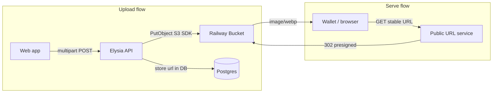

# Railway Media Storage

Production media uploads use **Railway Buckets** (S3-compatible object storage) with a public URL redirector for stable CDN-style links.

Railway buckets are private by default. Pair the bucket with Railway's [Public Bucket URLs](https://railway.com/deploy/public-bucket-urls) template so browsers and wallets can load images without hitting the API.

## Architecture



The API stores object keys under `media/{userId}/{tokenAddress}/{assetId}.webp`. The Public URL service maps `GET /{key}` to a presigned bucket URL, so `MEDIA_PUBLIC_BASE_URL` must match the service domain.

## Setup steps

### 1. Create a bucket

In your Railway project:

1. Click **+ New** → **Bucket**
2. Choose a region near your API service

Railway injects bucket credentials into the project (`BUCKET`, `ACCESS_KEY_ID`, `SECRET_ACCESS_KEY`, `ENDPOINT`, `REGION`).

### 2. Deploy the Public URL service

1. Deploy Railway's [Public Bucket URLs](https://railway.com/deploy/public-bucket-urls) template in the same project
2. Point it at the bucket credentials from step 1
3. Assign a custom domain (for example `media.yourdomain.com`)

### 3. Configure the API service

On the API service **Variables** tab:

| API variable | Source |
|--------------|--------|
| `STORAGE_DRIVER` | `s3` |
| `S3_BUCKET` | Bucket `BUCKET` value |
| `S3_ENDPOINT` | Bucket `ENDPOINT` value |
| `S3_REGION` | Bucket `REGION` value |
| `S3_ACCESS_KEY_ID` | Bucket `ACCESS_KEY_ID` value |
| `S3_SECRET_ACCESS_KEY` | Bucket `SECRET_ACCESS_KEY` value |
| `MEDIA_PUBLIC_BASE_URL` | Public URL service domain (no trailing slash), e.g. `https://media.yourdomain.com` |

Keep `PUBLIC_API_URL` set to your API host for non-media links.

### 4. Redeploy the API

After variables are set, redeploy the API. New uploads return URLs under `MEDIA_PUBLIC_BASE_URL`.

## Verification

- Upload an image via `POST /tokens/:address/media`
- Confirm `MediaAsset.url` starts with `MEDIA_PUBLIC_BASE_URL`
- Open the URL in a browser — the image loads without calling the API
- Token metadata `image` fields resolve from the CDN URL

## Local development

Use the default local driver (no bucket required):

```env
STORAGE_DRIVER=local
UPLOAD_DIR=./uploads
PUBLIC_API_URL=http://localhost:3001
```

See [Media uploads](/guides/media) for API usage.

## Migration notes

- **New uploads** automatically get CDN URLs once `STORAGE_DRIVER=s3` is set
- **Existing rows** with `PUBLIC_API_URL/...` links remain valid only if objects still exist on the old API disk; for pre-production deploys, a clean bucket start is simplest
- **On-chain metadata** referencing old API URLs may need a metadata refresh if tokens were deployed before migration

## Related docs

- [Media uploads](/guides/media) — upload, list, and environment variables
- [Getting started](/getting-started/) — local API setup
